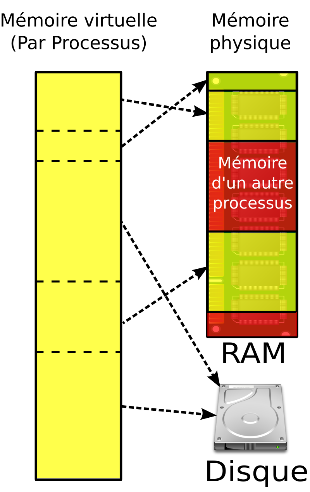

# Chargement des données

Une des premières étapes de notre entraînement c'est le chargement des données. C'est donc également un des premiers bottlenecks possible dans notre entraînement. On est également vite confronté à un mur lorsque l'on veut manipuler des datasets massifs (plusieurs TB de données).
Avoir un chargement des données efficace et optimisé est donc une première étape éssentielle.

# 1 - Map Dataset

Les deux principaux éléments de PyTorch pour le chargement des données sont le `Dataset` (disponible sous 2 versions mais on vera cela par la suite...) et le `Dataloader`.
La classe `Dataset` est assez simple:
```py
class CustomDataset(torch.utils.data.Dataset):
    def __init__(self, data):
        self.data = data
    
    def __len__(self):
        return len(self.data)
    
    def __getitem__(self, idx):
        return self.data[idx]
```
On accède aux données par un index, ce type de dataset est appelé 'Map Dataset'. Dans ce type de datasets les données sont généralement en RAM (ce qui nécéssite que le dataset passe en RAM...). Il est basique mais assez efficace pour des petits/moyens datasets.

# 2 - Dataloader

Le `Dataloader` est lui beaucoup plus intéréssant, nottament à cause des nombreux arguments incompris qu'il possède:
```py
torch.utils.data.DataLoader(
    dataset,
    batch_size=1,
    shuffle=None,
    sampler=None,
    batch_sampler=None,
    num_workers=0,
    collate_fn=None,
    pin_memory=False,
    drop_last=False,
    timeout=0,
    worker_init_fn=None,
    multiprocessing_context=None,
    generator=None,
    *,
    prefetch_factor=None,
    persistent_workers=False,
    in_order=True)
```
Certains valent le coup qu'on s'y penche dessus.

## 2.1 - Batch size

C'est un argument assez simple, il correspond au nombre de samples du dataset que le dataloader doit récupérer. Pourtant il peut avoir un impact assez fort dû à l'architecture actuelle des GPUs.


Un GPU possède des *warps*. Un warp est composé d'un certains nombre de threads (32 pour les architectures récentes) et tous les threads d'un warp sont exécutés en même temps.\
Ce qui veut dire que si on a un kernel (fonction qui tourne sur un GPU) qui à besoin que d'un seul thread, tous les autres threads (31 autres) seront en stand by et inutilisable tant que ce thread n'aura pas finit son exécution.\
C'est pour cela qu'on favorise une batch size multiple de 32 car cela correspond au nombre de threads dans un warp. On peut utiliser des multiples de 16 ou 8 mais il vaut mieux éviter d'aller au delà, cela peut réduire les performances.

## 2.2 - Workers

Un worker est un processus qui va s'occuper du chargement des données. L'avantage c'est que on peux donc avoir plusieurs workers qui travaillent en même temps pour charger la donnée.\
Si on a `num_wokers=0` alors le processus principal (celui qui s'occupe également de tout le reste dans notre entraînement) va s'occuper de charger les données. En revanche pour `num_workers=N` on va avoir $N$ différents processus qui vont s'occuper de charger les données, le processus principal reste focaliser sur le reste de notre entraînement.


En revanche ce n'est pas parfait:
- Comme la mémoire est partagé entre les processus, cela peut créer des accès concurentiels sur nos données et donc un potentiel bottleneck.
- Ajouter des workers revient aussi à augmenter la RAM nécéssaire ainsi que les opérations de communication (les processus utilise l'Inter Process Communication).
- Avoir trop de workers n'est également pas une bonne chose car cela entraine une forte utilisation CPU et donc un effet que l'on appelle le [*Noisy Neighbor*](https://facebookresearch.github.io/spdl/latest/optimization_guide/noisy_neighbour.html). Lorsque l'utilisation CPU est trop forte (à partir de 75% d'utilisation moyenne entre tous les coeurs), les coeurs CPU sont trop occupés à gérer la donnée et donc ont moins de temps pour lancer des kernels. Cela va donc ralentir notre entraînement même si on a beaucoup de workers qui chargent nos données.

Une bonne valeur se trouve en 2 et 6 workers de manière générale. Un benchmark rapide, quelques itérations sur votre boucle d'entraîment, peut lever le doute.

## 2.3 - Memory Pinning

> Avant de continuer la lecture, cette section aborde des méchanismes sur la mémoire d'un ordinateur. Allez lire l'annexe [RAM et Mémoire virtuelle](#annexe---ram-et-mémoire-virtuelle) si vous n'êtes pas familier avec son fonctionnement.

Le memory pinning ou épinglage mémoire (pas très beau...) est l'un des arguments les plus utlisé dans le dataloader sans vraiment savoir ce qu'il fait.\
Lorsque l'OS peut mettre une donnée (qui est stocké dans une page) à la fois dans le disque ou dans la RAM on dit qu'elle est paginable (ce qui est le comportement par défaut). Cependant pour transférer cette donnée vers le GPU, il est nécéssaire qu'elle soit dans la RAM, or l'OS peut transférer des pages de mémoire à sa guise vers le disque pour libérer de la place pour d'autres processus. On va donc figer (lock) cette donnée dans la RAM de façon a ce qu'elle ne puisse pas se retrouver dans le disque.\
C'est donc ce que va faire l'argument `pin_memory=True`, il va bloqué la donnée dans la RAM de façon à ce qu'elle puisse être transférer vers le GPU. Lorsque cette donnée est bloqué le GPU peut utiliser une technologie appelé Direct Acess Memory (DMA) qui permet au GPU de lire and écrire sans passer pas le CPU.\
L'intérêt c'est que des que la dataloader aura un batch de prêt, il sera épinglé à la RAM. Donc dès que le GPU en aura besoin, son transfert sera plus rapide. PyTorch s'occupe de lancer en fond un thread qui fera le bloquage en RAM pendant que l'on exécute d'autres actions dans notre code.\
Il est également intéressant de combiner cet argument avec `non_blocking`:
```py
batch.to(device, non_blocking=True)
```
Lorsque l'on active `non_blocking`, PyTorch lance un cuda stream (un flow d'éxacution d'opération sur le GPU) qui va s'occuper en parallèle de vers le transfert CPU&rarr;GPU. On a donc un thread dédié qui bloque la donnée en RAM et un stream dédié qui fait le transfert vers le GPU, ce qui permet de faire d'autres opérations lié à notre entrainement (`optimizer.zero_grad` par exemple).

## 2.4 - Prefetching

L'argument `prefetch_factor` permet de créer un buffer de batch ou le dataloader va charger des batch en avance. Si `prefetch_factor=2` alors chaque worker va charger 2 batch en avance. Dès qu'une itération sera finie et donc que 1 batch aura été consommé, un worker sera attitré pour ajouter le batch suivant à notre buffer.\
L'avantage de cet argument est qu'il nous permet d'avoir constamment des batchs d'avance et de ne pas faire attendre le GPU la préparation d'un batch par le CPU.\
Au vu de la plupart des observations, le paramètre par défaut dans le dataloader suffit (2 batchs en avance). Si vous avez un traitement assez lourd à faire, essayez d'augmenter cette valeur.

## 2.5 - A retenir

- Priviligiez une batch size multiple de 32
- Utilisez entre 2 et 6 workers dans votre dataloader. Faites un benchmark rapide pour trouver le bon sweet spot et surtout évitez une haute utilisation CPU pour ne pas avoir d'effet de noisy neighbor
- Activez le memory pinning et faites en sorte que l'ensemble de vos transfert vers le GPU utilise le paramètre `non_blocking=True`

# 3 - Memory mapped files

# 4 - Iterable Dataset

# 5 - Sequence Packing

# Section sur notre infra et comment elle peut aider pour le chargement des données

# Annexe - RAM et Mémoire virtuelle

La mémoire d'un ordinateur se compose de 2 principaux éléments, la mémoire physique et la mémoire virtuelle.

## Mémoire physique

Plus communément appelé RAM (Random Access Memory), la RAM représente la mémoire physique de l'odinateur.\
On peut voir la RAM comme une grande grille de boîte ou chaque boîte possède un identifiant bien précis, plus connue sous le nom d'adresse. Chaque boîte de cette grille peut contenir des données. Pour récupérer ces données on a donc besoin de connaitre l'adresse exacte vers la boîte.\
La gestion de la mémoire physique est complexe. Elle est laissé au système d'exploitation (OS), autrement ce serait le chaos total si chaque programme gérait sa mémoire. Un programme peut également avoir besoin de plus de RAM que nécéssaire, la mémoire physique ne suffit donc pas dans ce cas la et il va falloir utiliser d'autres moyens/techniques

## Mémoire virtuelle

Pour faciliter la gestion de la RAM ainsi que le cas ou certains programmes ont besoin de plus de mémoire que ce qui est disponible physiquement, on utilise la mémoire virtuelle et c'est l'OS qui s'en occupe.\
Pour chaque programme l'OS va créer une mémoire virtuelle. Ca se présente sous la forme d'une table qui est privée au programme, un programme à accès uniquement à sa mémoire virtuelle. Cette table commence à l'adresse 0.\
Cette table est faite de pages qui font par défaut 4 KB. L'OS de son côté maintient une seconde table, la table des pages ou page table. C'est grâce à cette table que l'OS peut traduire une adresse virtuelle vers une adresse physique ou plutôt traduit une page vers une frame (bloc physique de mémoire de la même taille que la page). Ainsi pour un programme la mémoire virtuelle apprait contigu et organisé mais c'est grâce à l'OS qui lui sait ou se trouve réellement les frames.\
Il est également possible que les pages soient liés a une frame sur le disque plutôt que dans la RAM. Cela permet de continuer à allouer de la mémoire même lorsque l'on a plus de place en RAM. Ce principe s'apelle le swapping.\
Pour accèlérer le tout, les ordinateurs possèdent un composant appelé Memory Management Unit (MMU), qui permet de faire les traductions pages &rarr; frames de manière instantané.\
Voici un schéma représentatif de la gestion de la mémoire dans notre ordinateur:




