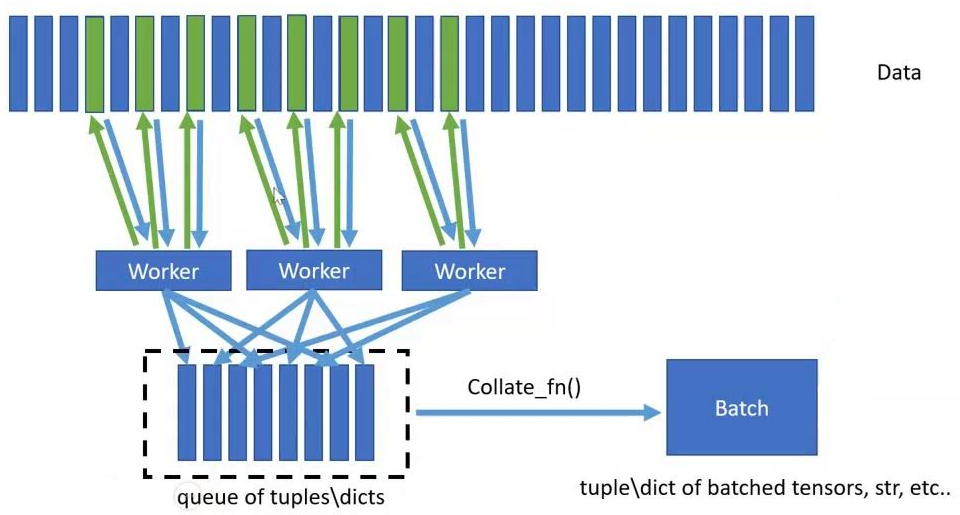
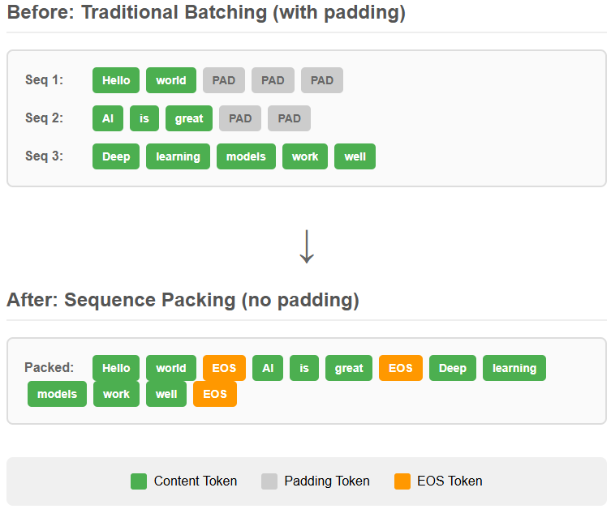
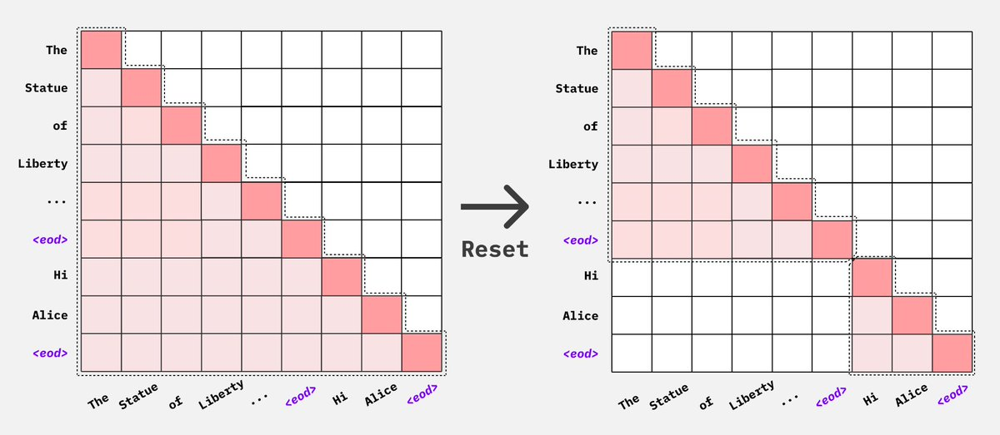
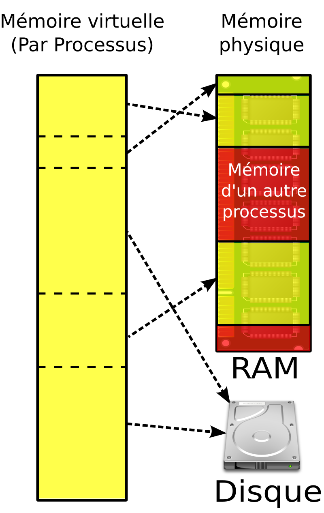

# Chargement des données

Une des premières étapes de notre entraînement c'est le chargement des données. C'est donc également un des premiers bottlenecks possible dans notre entraînement. On est également vite confronté à un mur lorsque l'on veut manipuler des datasets massifs (plusieurs TB de données).
Avoir un chargement des données efficace et optimisé est donc une première étape éssentielle.

# 1 - Map Dataset

Les deux principaux éléments de PyTorch pour le chargement des données sont le `Dataset` (disponible sous 2 versions mais on vera cela par la suite...) et le `Dataloader`.
La classe `Dataset` est assez simple:
```py
class CustomDataset(torch.utils.data.Dataset):
    def __init__(self, data):
        self.data = data
    
    def __len__(self):
        return len(self.data)
    
    def __getitem__(self, idx):
        return self.data[idx]
```
On accède aux données par un index, ce type de dataset est appelé 'Map Dataset'. Dans ce type de datasets les données sont généralement en RAM (ce qui nécéssite que le dataset passe en RAM...). Il est basique mais assez efficace pour des petits/moyens datasets.

# 2 - Dataloader

Le `Dataloader` est lui beaucoup plus intéréssant, nottament à cause des nombreux arguments incompris qu'il possède:
```py
torch.utils.data.DataLoader(
    dataset,
    batch_size=1,
    shuffle=None,
    sampler=None,
    batch_sampler=None,
    num_workers=0,
    collate_fn=None,
    pin_memory=False,
    drop_last=False,
    timeout=0,
    worker_init_fn=None,
    multiprocessing_context=None,
    generator=None,
    *,
    prefetch_factor=None,
    persistent_workers=False,
    in_order=True)
```
Certains valent le coup qu'on s'y penche dessus.

## 2.1 - Batch size

C'est un argument assez simple, il correspond au nombre de samples du dataset que le dataloader doit récupérer. Pourtant il peut avoir un impact assez fort dû à l'architecture actuelle des GPUs.


Un GPU possède des *warps*. Un warp est composé d'un certains nombre de threads (32 pour les architectures récentes) et tous les threads d'un warp sont exécutés en même temps.\
Ce qui veut dire que si on a un kernel (fonction qui tourne sur un GPU) qui à besoin que d'un seul thread, tous les autres threads (31 autres) seront en stand by et inutilisable tant que ce thread n'aura pas finit son exécution.\
C'est pour cela qu'on favorise une batch size multiple de 32 car cela correspond au nombre de threads dans un warp. On peut utiliser des multiples de 16 ou 8 mais il vaut mieux éviter d'aller au delà, cela peut réduire les performances.

## 2.2 - Workers

Un worker est un processus qui va s'occuper du chargement des données. L'avantage c'est que on peux donc avoir plusieurs workers qui travaillent en même temps pour charger la donnée.\
Si on a `num_wokers=0` alors le processus principal (celui qui s'occupe également de tout le reste dans notre entraînement) va s'occuper de charger les données. En revanche pour `num_workers=N` on va avoir $N$ différents processus qui vont s'occuper de charger les données, le processus principal reste focaliser sur le reste de notre entraînement.



En revanche ce n'est pas parfait:
- Comme la mémoire est partagé entre les processus, cela peut créer des accès concurentiels sur nos données et donc un potentiel bottleneck.
- Ajouter des workers revient aussi à augmenter la RAM nécéssaire ainsi que les opérations de communication (les processus utilise l'Inter Process Communication).
- Avoir trop de workers n'est également pas une bonne chose car cela entraine une forte utilisation CPU et donc un effet que l'on appelle le [*Noisy Neighbor*](https://facebookresearch.github.io/spdl/latest/optimization_guide/noisy_neighbour.html). Lorsque l'utilisation CPU est trop forte (à partir de 75% d'utilisation moyenne entre tous les coeurs), les coeurs CPU sont trop occupés à gérer la donnée et donc ont moins de temps pour lancer des kernels. Cela va donc ralentir notre entraînement même si on a beaucoup de workers qui chargent nos données.

Une bonne valeur se trouve en 2 et 6 workers de manière générale. Un benchmark rapide, quelques itérations sur votre boucle d'entraîment, peut lever le doute.

## 2.3 - Memory Pinning

> Avant de continuer la lecture, cette section aborde des méchanismes sur la mémoire d'un ordinateur. Allez lire l'annexe [RAM et Mémoire virtuelle](#annexe---ram-et-mémoire-virtuelle) si vous n'êtes pas familier avec son fonctionnement.

Le memory pinning ou épinglage mémoire (pas très beau...) est l'un des arguments les plus utlisé dans le dataloader sans vraiment savoir ce qu'il fait.\
Lorsque l'OS peut mettre une donnée (qui est stocké dans une page) à la fois dans le disque ou dans la RAM on dit qu'elle est paginable (ce qui est le comportement par défaut). Cependant pour transférer cette donnée vers le GPU, il est nécéssaire qu'elle soit dans la RAM, or l'OS peut transférer des pages de mémoire à sa guise vers le disque pour libérer de la place pour d'autres processus. On va donc figer (lock) cette donnée dans la RAM de façon a ce qu'elle ne puisse pas se retrouver dans le disque.\
C'est donc ce que va faire l'argument `pin_memory=True`, il va bloqué la donnée dans la RAM de façon à ce qu'elle puisse être transférer vers le GPU. Lorsque cette donnée est bloqué le GPU peut utiliser une technologie appelé Direct Acess Memory (DMA) qui permet au GPU de lire and écrire sans passer pas le CPU.\
L'intérêt c'est que des que la dataloader aura un batch de prêt, il sera épinglé à la RAM. Donc dès que le GPU en aura besoin, son transfert sera plus rapide. PyTorch s'occupe de lancer en fond un thread qui fera le bloquage en RAM pendant que l'on exécute d'autres actions dans notre code.\
Il est également intéressant de combiner cet argument avec `non_blocking`:
```py
batch.to(device, non_blocking=True)
```
Lorsque l'on active `non_blocking`, PyTorch lance un cuda stream (un flow d'éxacution d'opération sur le GPU) qui va s'occuper en parallèle de vers le transfert CPU&rarr;GPU. On a donc un thread dédié qui bloque la donnée en RAM et un stream dédié qui fait le transfert vers le GPU, ce qui permet de faire d'autres opérations lié à notre entrainement (`optimizer.zero_grad` par exemple).

## 2.4 - Prefetching

L'argument `prefetch_factor` permet de créer un buffer de batch ou le dataloader va charger des batch en avance. Si `prefetch_factor=2` alors chaque worker va charger 2 batch en avance. Dès qu'une itération sera finie et donc que 1 batch aura été consommé, un worker sera attitré pour ajouter le batch suivant à notre buffer.\
L'avantage de cet argument est qu'il nous permet d'avoir constamment des batchs d'avance et de ne pas faire attendre le GPU la préparation d'un batch par le CPU.\
Au vu de la plupart des observations, le paramètre par défaut dans le dataloader suffit (2 batchs en avance). Si vous avez un traitement assez lourd à faire, essayez d'augmenter cette valeur.

## 2.5 - A retenir

- Priviligiez une batch size multiple de 32
- Utilisez entre 2 et 6 workers dans votre dataloader. Faites un benchmark rapide pour trouver le bon sweet spot et surtout évitez une haute utilisation CPU pour ne pas avoir d'effet de noisy neighbor
- Activez le memory pinning et faites en sorte que l'ensemble de vos transfert vers le GPU utilise le paramètre `non_blocking=True`

# 3 - Memory mapped files

Le problème des gros datasets c'est qu'il ne passe généralement pas en RAM. Leur stockage devient vite compliqué et surtout avoir un chargement efficace des samples peut s'avérer être une prise de tête.\
Certains format populaires comme parquet permette de compresser les données et un offrent un stockage optimal. Cependant leur lecture n'est pas forcement rapide (décompression nécéssaire), ce qui sera amplifié par le nombre de GPUs qui ont besoin de données.\
Un des format le plus adaptés pour les gros datasets est le memory mapping (voir [RAM et Mémoire virtuelle](#annexe---ram-et-mémoire-virtuelle)). Les memory mapped files (désolé j'ai pas trouvé de bonne traduction...) sont principalement des fichiers binaires, et chaque page de la mémoire virtuelle du programme peut être lié à une partie du fichier (généralement 4 KB par défaut) au lieu de la RAM. Lorsque l'on a besoin d'une partie spécifique de notre fichier, comme pour la mémoire classique, l'OS va venir faire la traduction page &rarr; données, la seule différence étant que la donnée n'est pas une frame en RAM mais un bloc de notre fichier.\
Cela présente 2 gros avantages, on a pas besoin de charger le fichier entier mais seulement une page a un instant $t$ ce qui évite de faire exploser notre RAM. De plus la lecture de ces fichier est seulement faite à partir d'opérations mémoire basique que l'OS sait très bien faire, ce qui rend la lecture très rapide.\
Ce format n'est cependant pas parfait, comme on doit charger une page entière à chaque fois, la lecture aléatoire n'est pas très efficace. Il faut donc priviligier la lecture séquentielle, et éviter ou préparer en amont le shuffling des données.

On peut utiliser numpy pour manipuler des memmap (abréviation couramment utilisé pour memory mapped files). Pour la création par exemple:
```py
import numpy as np

data = np.arange(12, dtype=np.float32).reshape(3, 4)

# 'w+' allows reading and writing
mmap_file = np.memmap('example.dat', dtype='float32', mode='w+', shape=(3, 4))
mmap_file[:] = data[:]

# Ensure changes are written to disk
mmap_file.flush()
```
Pour la lecture:
```py
read_only_mmap = np.memmap('example.dat', dtype='float32', mode='r', shape=(3, 4))
```
Attention, les dimensions de vos données ne sont pas sauvegardés dans la memmap, il faut les précisées à la lecture. Une bonne manière de faire est de créer un header avec `struct` et sauvegarder les données utiles dedans. Ensuite lors de la lecture de votre memmap, vous pouvez lire le header pour savoir comment charger les données.
```py
import numpy as np
import struct
import os

shape = (3, 4)
dtype = np.float32
data = np.arange(12, dtype=dtype).reshape(shape)

header_format = '2IH' # 2 unsigned int and one unsigned short int
header_size = struct.calcsize(header_format)
dtype_code = np.dtype(dtype).num
header = struct.pack(header_format, shape[0], shape[1], dtype_code)

file_name = 'data_with_header.mmap'
with open(file_name, 'wb') as f:
    f.write(header)
    f.write(data.tobytes())
```
Lors de la lecture:
```py
with open(file_name, 'rb') as f:
    header = f.read(header_size)
    unpacked_header = struct.unpack(header_format, header)

    read_shape = (unpacked_header[0], unpacked_header[1])
    read_dtype_code = unpacked_header[2]
    read_dtype = np.dtype(read_dtype_code)

mmap_array = np.memmap(
    file_name, 
    dtype=read_dtype, 
    mode='r', 
    offset=header_size, # L'offset permet de sauter l'en-tête
    shape=read_shape
)
```
On a donc besoin de savoir uniquement la taille du header à l'avance plutôt que toutes les données lié à la memmap comme sa shape etc..

# 4 - Iterable Dataset

On a vu au début que le dataset classique de PyTorch est le ``Map Dataset``. Cependant pour la lecture de gros datasets, ce n'est pas adapté. Il necessite généralement que les données (ou une grande partie) soient en RAM. De plus il lit les éléments un par un, donc pour des fichiers qui ne sont pas deja en RAM, ca entraine des lectures lentes.\
Pour cela PyTorch propose un autre type de dataset appelé `Iterable Dataset`. Il est adapté a des cas ou le dataset ne passe pas en RAM. Quand les données sont trop larges pour passer en RAM, on va lire les données en flux plutot que en un gros bloc en RAM. Cela s'apparente à du lazy loading ou l'on charge les données à la demande.
```py
class IterableCSVDataset(IterableDataset):
    def __init__(self, filename):
        super().__init__()
        self.filename = filename

    def __iter__(self):
        # Open the file and yield each line as a sample
        with open(self.filename, 'r') as f:
            # Yield each line one by one
            for line in f:
                parts = line.strip().split(',')
                data = float(parts[0])
                label = float(parts[1])
                yield torch.tensor(data), torch.tensor(label)
```
Le dataset utilise maintenant la méthode `__iter__` contrairement a `__getitem__`. Cela va yield des samples ou bloc de samples de notre dataset. Dans l'exemple, on ouvre le fichier et yield les lignes une à une (tant que la ligne n'aura pas été consommé, rien se passe). Le process sera répété jusqu'a la fin du fichier. On a donc besoin de charger qu'une seule ligne de notre fichier au fur et à mesure au lieu du fichier entier.\
On peut également avoir plusieurs workers qui chargent les données mais il faut nous même définir la stratégie, autrement ils chargeront tous la même donnée.
```py
class MultiWorkerIterableFileDataset(IterableDataset):
    def __init__(self, filename):
        super().__init__()
        self.filename = filename

    def __iter__(self):
        # Get worker information from PyTorch
        worker_info = torch.utils.data.get_worker_info()
        
        # If no worker info is available (single process), read the entire file
        if worker_info is None:
            start_line = 0
            end_line = float('inf')
        else:
            # Partition the data for each worker
            worker_id = worker_info.id
            num_workers = worker_info.num_workers
            
            # Each worker gets a slice of the file
            with open(self.filename, 'r') as f:
                # Count total lines
                total_lines = sum(1 for line in f)
            
            per_worker = total_lines // num_workers
            start_line = worker_id * per_worker
            end_line = start_line + per_worker
            if worker_id == num_workers - 1:
                end_line = total_lines # Make sure the last worker gets the remaining lines

        # Stream the data for the assigned slice
        with open(self.filename, 'r') as f:
            for i, line in enumerate(f):
                if i >= start_line and i < end_line:
                    yield line.strip()
                if i >= end_line:
                    break
```
Ici on sépare nos données en bloc égaux afin que chaque worker ait une portion égale. Puis chaque worker s'occupe de charger sa propre section et de fournir un sample.

# 5 - Sequence Packing

Lorsque l'on crée des batch de données, on ne peut pas toujours avoir des samples de même taille. Par exemple pour du texte, les phrases ne font pas toutes la même taille. Pour cela on utilise principalement du padding. Lorsque un sample de fait pas la taille souhaité, on ajoute des valeurs afin que celui ci fasse la bonne taille. Pour reprendre l'exemple du texte, on ajoute des tokkens de padding, souvent `<pad>` qui permettent spécifié que ce sont des tokkens fictifs, juste pour avoir la taille voulu.\
Le problème est que ces tokkens de padding ne servent à rien, ils sont juste la pour combler le trou entre les différentes phrases de notre batch. Cela revient à utiliser de la puissance de calcul et de la VRAM pour des tokkens fictifs.\
Pour combler cela, on peut utiliser le 'sequence packing'. Le principe est simple, plutôt que d'avoir une seule donnée par sample dans un batch, on peut concaténer les données jusqu'a ce que notre sample soit plein. Un exemple en image:



Pour du texte, cela revient à concaténer plusieurs phrases dans une seule séqence de notre batch. On utilise un token `<eos>` pour signifier que l'on à atteint la fin d'une phrase et que l'on va lire la suivante. En revanche si on utilise un transformer (ce qui est très courant) on va avoir besoin de faire quelques modifications. De base le masque d'attention est triangulaire et plein, mais cela implique que des tokkens d'une phrase peuvent voir les tokkens d'une autre phrase (ce que l'on ne souhaite pas). Pour cela on peut modifier le masque d'attention:



Lorsque l'on atteint un tokken `<eos>`, on reset notre masque d'attention de façon a ce que les tokkens ne puissent pas ce voir d'une séquence à l'autre. Voici un exemple de code (crédit: [https://huggingface.co/blog/sirluk/llm-sequence-packing](https://huggingface.co/blog/sirluk/llm-sequence-packing)):
```py
def get_attention_mask_for_packed_sequence(x, token_id, eos: bool = True):
    B, T = x.shape
    eos_idx = (x.view(-1) == token_id).nonzero(as_tuple=True)[0] + eos
    eos_idx_expanded = torch.cat([eos_idx, torch.arange(0,B*T+1,T)]).unique().sort()[0]
    normalized_idx = eos_idx_expanded - (eos_idx_expanded // T) * T
    normalized_idx = torch.where(normalized_idx == 0, T, normalized_idx)
    reps = normalized_idx[1:] - normalized_idx[:-1]
    reps = torch.where(reps < 1, normalized_idx[1:], reps)
    repeated_idx = torch.repeat_interleave(normalized_idx[1:], reps).view(B,1,T).expand(-1,T,-1)
    mask_indices = torch.arange(T).view(1,-1,1).expand(B, -1, T)
    mask = torch.ones(T, T, dtype=torch.bool).tril().expand(B, -1, -1)
    mask = mask.masked_fill(mask_indices >= repeated_idx, False)
    return mask
```
Cela permet de créer le masque d'attention en fonction des tokens `<eos>` ou `<bos>` (begining of sentence) de votre batch. En revanche il faut garder en tête que c'est une opération qui peut devenir lourde. Pour éviter un ralentissement, il est conseillé d'inclure la création du masque sur GPU pour éviter des transferts mémoire et profiter de la parallélistation des GPUs. Pour cela vous pouvez ajouter cette fonction dans votre modele et ajouter un argument `packed=True`:
```py
class SimpleModel(nn.Module):
    def __init__(self, vocab_size, embedding_dim, hidden_dim, eos_token_id):
        super().__init__()
        self.embedding = nn.Embedding(vocab_size, embedding_dim)
        self.attention = nn.MultiheadAttention(embedding_dim, num_heads=1)
        self.eos_token_id = eos_token_id

    def forward(self, x, packed=True):
        x_emb = self.embedding(x)
        
        attention_mask = None
        if packed:
            attention_mask = get_attention_mask_for_packed_sequence(x, self.eos_token_id)

        x_emb = x_emb.transpose(0, 1)
        
        attn_output, attn_weights = self.attention(
            x_emb,
            x_emb,
            x_emb,
            attn_mask=attention_mask
        )
        
        return attn_output.transpose(0, 1)
```
A partir du moment ou le modele sera sur GPU, le packing se fera sur GPU et sera donc très rapide.\

# 6 - Pré-traitement

Il est assez courant de devoir effectuer des pré-traitement sur les données avant pouvoir les utiliser pour notre modèle (tokenization, augmentations et autres). Cependant c'est généralement assez couteux en ressources et faire perdre du temps lors de la créationd des batchs. Certains arguments du data loader permettent de réduire cela comme `num_workers` ou encore `prefetch_factor` mais sont généralement pas suffisant.\

Pour cela il vaut mieux faire les traitements en amont, puis sauvegarder le résulat dans un format efficace (comme les memmaps par exemples 😊). Cela permettra de récupérer les données deja prêtes lors de l'entrainement pour maximiser au mieux l'utilisation GPU contre plus d'espace de stockage.\
Pour un dataset de texte, on peut imaginer avoir notre dataset original au format ``parquet`` (compressé donc moins de stockage nécéssaire) puis faire sur CPU notre tokenization que l'on va sauvegarder dans des memmaps. On pourra ensuite utilser ces memmaps lors de l'entraiment et ne pas avoir besoin de faire de tokenization à la volé ce qui permet de reduire considérablement le temps de génértion d'un batch. Les CPUs seront ausi moins occupé et donc permet d'éviter l'effet de noisy neighbor.\
Les inconvénients sont que l'on a besoin de plus d'espace disque et que ca peut vite devenir conséquent. Cela fige aussi nos données et donc si on fait des modifications sur les données/méthode de traitement on doit regénérer notre dataset.

Dans un cas plus extreme ou l'on a un pre-traitement trop lourd pour être fait à l'avance, on peut essayer de le déporter sur d'autres ressources. Par exemple on peut mettre en place un serveur CPU qui s'occupe du traitement des données, puis par le réseau, le serveur GPU vient récupérer les données traités pour sont entrainement.

# Annexe - RAM et Mémoire virtuelle

La mémoire d'un ordinateur se compose de 2 principaux éléments, la mémoire physique et la mémoire virtuelle.

## Mémoire physique

Plus communément appelé RAM (Random Access Memory), la RAM représente la mémoire physique de l'odinateur.\
On peut voir la RAM comme une grande grille de boîte ou chaque boîte possède un identifiant bien précis, plus connue sous le nom d'adresse. Chaque boîte de cette grille peut contenir des données. Pour récupérer ces données on a donc besoin de connaitre l'adresse exacte vers la boîte.\
La gestion de la mémoire physique est complexe. Elle est laissé au système d'exploitation (OS), autrement ce serait le chaos total si chaque programme gérait sa mémoire. Un programme peut également avoir besoin de plus de RAM que nécéssaire, la mémoire physique ne suffit donc pas dans ce cas la et il va falloir utiliser d'autres moyens/techniques

## Mémoire virtuelle

Pour faciliter la gestion de la RAM ainsi que le cas ou certains programmes ont besoin de plus de mémoire que ce qui est disponible physiquement, on utilise la mémoire virtuelle et c'est l'OS qui s'en occupe.\
Pour chaque programme l'OS va créer une mémoire virtuelle. Ca se présente sous la forme d'une table qui est privée au programme, un programme à accès uniquement à sa mémoire virtuelle. Cette table commence à l'adresse 0.\
Cette table est faite de pages qui font par défaut 4 KB. L'OS de son côté maintient une seconde table, la table des pages ou page table. C'est grâce à cette table que l'OS peut traduire une adresse virtuelle vers une adresse physique ou plutôt traduit une page vers une frame (bloc physique de mémoire de la même taille que la page). Ainsi pour un programme la mémoire virtuelle apprait contigu et organisé mais c'est grâce à l'OS qui lui sait ou se trouve réellement les frames.\
Il est également possible que les pages soient liés a une frame sur le disque plutôt que dans la RAM. Cela permet de continuer à allouer de la mémoire même lorsque l'on a plus de place en RAM. Ce principe s'apelle le swapping.\
Pour accèlérer le tout, les ordinateurs possèdent un composant appelé Memory Management Unit (MMU), qui permet de faire les traductions pages &rarr; frames de manière instantané.\
Voici un schéma représentatif de la gestion de la mémoire dans notre ordinateur:




