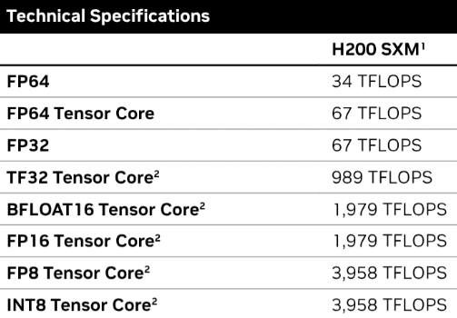
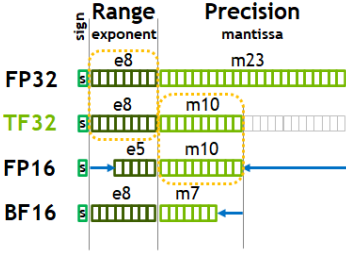
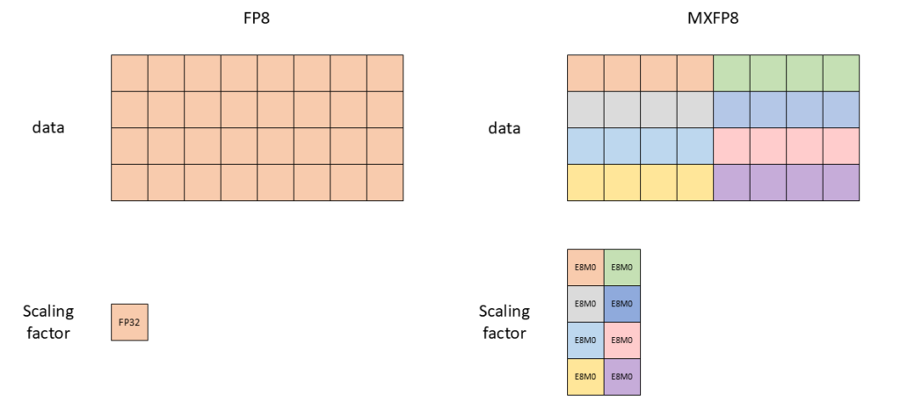
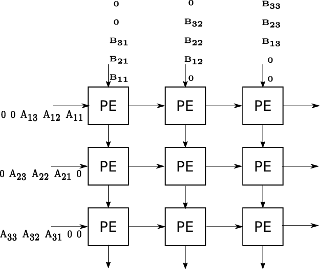

# Optimisations d'entrainement GPU

Par défaut les entrainement avec PyTorch sont lents et peu optimisés. Il existe quelques méthodes pour améliorer tout cela avec des changements de code minimaux et sans utiliser plus de ressources de calcul.

> Crédit: https://www.youtube.com/watch?v=l8pRSuU81PU. Cette vidéo à servie de support de base pour l'élaboration de ce blog.

> Tout ce qui est présenté ici est applicable à partir de 1 GPU jusqu'à $\infty$.

# 1 - Mixed precision

Surement une méthode que vous connaissez déjà via des frameworks comme HuggingFace. Lorsque vous écrivez du code avec PyTorch toutes vos opérations et types de variables sont en Float 32 par défaut. Cependant il est possible de réaliser ces opérations ou de stocker ces variables dans des précisions inférieures comme le Float 16 par exemple.\
L'avantage de cette baisse de précision c'est que les opérations seront plus rapide (moins de bits à manipuler) et moins gourmandes en RAM (moins de bits à stocker). Cependant elles peuvent impacter la précision du résultat du à la réduction du nombre de bits pour représenter un nombre flottant (pour certaines précisions comme le Float 16 cette baisse de précision est dans la majorité des cas négligeable).



*valeurs pour des matrices sparses. A diviser par deux pour avoir la valeur réelle.

On peut bien voir ici, sur les spécifications des H200, que l'on double le nombre d'opérations possibles entre le FP32/TF32 (494 TFLOPS) et le et le FP16/BFLOAT16 (989 TFLOPS).

## 1.1 - Nombres à virgule flottante

Un nombre flottant c'est un nombre a virgule comme $342342.95763$.



Les nombres flottants sont représentés en bits par le biais de la notation scientifique (Ex: $2\times10^{5}$). Selon le standard IEEE 754, cette notation contient 3 éléments:
- Le signe - c'est ce qui détermine si le nombre est négatif ou positif, 1=négatif et 0=positif.
- L'exposant - c'est la puissance que l'on donne à notre nombre. Cependant comme on a pas de bit de signe, il faut utiliser un biais pour réprésenter les valeurs négative. Ce qui nous donne $exposant = exposant\_stocké - biais$. Le biais est calculé de la manière suivante &rarr; $biais=2^{n-1}-1$ avec $n$ le nombre de bit pour stocker notre exposant.
- La mantisse - c'est une suite de fraction permettant de représenter le significant de notre nombre. C'est une suite géométrique de la valeur suivante:
$$M = \sum_{i=1}^{n}b_i\times2^{-i}$$
où $b_i$ est le i-ème bit de la mantisse.

Ainsi la formule suivante permet de représenter notre nombre flottant: $signe\times2^{exposant-biais}\times mantisse$.

Pour éclaircir tout cela, voici un exemple concret. Si on veut écrire le nombre -1.625 en FP16 avec cette representation:
- signe = -1
- exposant = $2^0$
- mantisse = $1+\frac{1}{2}+\frac{1}{8}$

Ce qui nous donne en FP16:\
$1\space01111\space1010000000$ \
&rarr; $1$ pour le signe négatif\
&rarr; $01111$ qui donne $2^0$ (16 bits soit biais de 15 donc exposant = 15 - 15 = 0)\
&rarr;$1010000000$ qui donne $1+2^{-1}+2^{-3}=1.625$. La première valeur de la série est explicite et donc non stocké.

Heureusement pour nous tout est déjà géré dans PyTorch ou autre framework, cependant cela permet de bien se rendre compte de la différence entre les différentes précisions des nombres flottants.

## 1.2 - Brain Float 16

Si on compare le FP16 et le FP32 (cf image ci-dessus), on peut voir que leur exposant n'ont pas le même nombre de bits. Cela veut dire que le FP32 à des valeurs d'exposant entre $[2^{-126}, 2^{127}]$ et le FP16 $[2^{-14}, 2^{15}]$. On se rend très vite compte que si l'on veut utiliser des nombres en FP32 et FP16 ensemble, il va falloir faire des conversions et que l'on risque d'avoir des overflows/underflow.\
La solution simple pourrait être d'utiliser seulement du FP16 ou FP32, malheureusement avec seulement du FP16 dans nos entraînement on serait confronté à plus d'instabilité (gradient trop petit &rarr; underflow). Et si on utilise que du FP32 on ne peut pas bénéficier de la rapidité du FP16.\
Pour cela Google à développé le Brain Float 16. Le principe est assez simple, on utilise le même exposant que en FP32. Cela permet donc d'éviter les overflow/underflow avec le FP32 en sacrifiant un peut de précision sur la mantisse. C'est tout a fait acceptable dans notre cas, on souhaite généralement représenter des nombres très petis ou très grand mais pas forcement très précis (de plus la précision peut être comblé par l'entrainement).\
C'est aujourd'hui le format le plus utilisé dans l'IA que ce soit pour l'entraiement des modèles ou même le stockage.

## 1.3 - Utilisation en PyTorch

Voyons maitenant comment mettre tous cela en place avec PyTorch. Vous pouvez le faire manuellement en mettant vous mêmes le type à utiliser pour votre modèle/données. Cependant je vous le déconseille vivement, il y a de fortes chances que certains types n'aillent pas ensemble et que votre entrainement devienne instable.\
L'intérêt de la mixed precision c'est que toutes les opérations ne doivent pas utiliser le même type. Certaines opérations comme les couches linéaires ou les convolutions bénéficient fortement du passage en FP16 ou BF16, elles seront beaucoup plus rapides. En revanche certaines opérations comme la loss ont besoin de la plage dynamique plus grande du FP32.\
Ainsi pour cela, PyTorch possède une fonction qui permet d'automatiquement caster les opérations et variables dans le bon type &rarr; *Torch Automatic Mixed Precision* ou aussi appelé *AMP*.\
De manière générale, les opérations sont en BF16 et leur accumulation en FP32. La liste des opérations qui peuvent être mise en FP16 se trouvent ici [https://pytorch.org/docs/stable/amp.html#cuda-op-specific-behavior](https://docs.pytorch.org/docs/stable/amp.html#cuda-op-specific-behavior).\
Voyons ce que cela donne:
```python
for epoch in range(0): # 0 epochs, this section is for illustration only
    for input, target in zip(data, targets):
        # Runs the forward pass under ``autocast``.
        with torch.autocast(device_type=device, dtype=torch.bfloat16):
            output = net(input)
            # output is bfloat16 because linear layers ``autocast`` to bfloat16.
            assert output.dtype is torch.bfloat16

            loss = loss_fn(output, target)
            # loss is float32 because ``mse_loss`` layers ``autocast`` to float32.
            assert loss.dtype is torch.float32

        # Exits ``autocast`` before backward().
        # Backward passes under ``autocast`` are not recommended.
        # Backward ops run in the same ``dtype`` ``autocast`` chose for corresponding forward ops.
        loss.backward()
        opt.step()
        opt.zero_grad()
```
On peut voir ici que qu'une simple utilisation de `torch.autocast` comme context manager permet de gérer pour nous si les opérations sont en BF16 ou FP32.\
Si on veut faire la même opération pour le FP16, on va avoir besoin d'un "gradient scaler". Comme on a vu precedemment, le FP32 et FP16 n'ont pas la même range. Pour éviter les underflow/overflow, on a besoin de rescale les gradients:
```python
scaler = torch.cuda.amp.GradScaler()

for epoch in range(0): # 0 epochs, this section is for illustration only
    for input, target in zip(data, targets):
        with torch.autocast(device_type=device, dtype=torch.float16):
            output = net(input)
            loss = loss_fn(output, target)

        # Scales loss. Calls ``backward()`` on scaled loss to create scaled gradients.
        scaler.scale(loss).backward()

        # ``scaler.step()`` first unscales the gradients of the optimizer's assigned parameters.
        # If these gradients do not contain ``inf``s or ``NaN``s, optimizer.step() is then called,
        # otherwise, optimizer.step() is skipped.
        scaler.step(opt)

        # Updates the scale for next iteration.
        scaler.update()

        opt.zero_grad() # set_to_none=True here can modestly improve performance
```
On peut donc voir que le BF16 est bien plus adapté pour faire du machine learning car il permet de mieux représenter les petits gradient contrairement au FP16 et donc permet un entrainement plus stable, essayez de favoriser le BF16 au FP16. Pour plus d'infos sur la mixed precision, voici un bon tuto fait par PyTorch https://pytorch.org/tutorials/recipes/recipes/amp_recipe.html.

## 1.4 - FP8

Depuis l'arrivé des H100, il y a eu également des tensor cores (que l'on vera un peu plus tard) dédié pour du FP8, ce qui rend les entrainement en FP8 possible.\
Le FP8 vient en 2 formats possible:
- FP8 E4M3 &rarr; 1 bit de signe, 4 bits pour l'exposant et 3 bits pour la mantisse. Ce format favorise la précision pour la forward pass.
- FP8 E5M2 &rarr; 1 bit de signe, 5 bits pour l'exposant et 2 bits pour la mantisse. Ce format favorise la grande variation de valeurs nécéssaire pour la backward.

De grands acteurs comme DeepSeek ou OpenAI ont réalisés des entrainements de leur modèles en FP8, ce qui démontre la viabilité de cette méthode. Cependant le FP8 n'est pas appliqué sur de nombreuses couches. Comme precedemment ou certaines layers sont en BF16 et d'autres en FP32, pour le FP8 seul les couches linéaires en bénéficient. Même si cela parait restreint c'est quand même une grande partie des modèles modernes.\
Pour entrainé un modèle en FP8, il faut installer `torchao` car ce n'est pas encore natif dans PyTorch. Voici a quoi ressemble le code pour un entrainement sur un seul GPU:
```py
import torch
import torch.nn as nn
from torchao.float8 import convert_to_float8_training, Float8LinearConfig

# create model and sample input
M, K, N = 4096, 8192, 4096
m = nn.Sequential(
    nn.Linear(K, N, bias=False),
    nn.Linear(N, 128, bias=False),
).bfloat16().cuda()
x = torch.randn(M, K, device="cuda", dtype=torch.bfloat16)
optimizer = torch.optim.SGD(m.parameters(), lr=0.1)

# optional: filter modules from being eligible for float8 conversion
def module_filter_fn(mod: torch.nn.Module, fqn: str):
    # don't convert the last module
    if fqn == "1":
        return False
    # don't convert linear modules with weight dimensions not divisible by 16
    if isinstance(mod, torch.nn.Linear):
        if mod.in_features % 16 != 0 or mod.out_features % 16 != 0:
            return False
    return True

# configure float8 recipe
# valid recipe names: "tensorwise", "rowwise", "rowwise_with_gw_hp"
config = Float8LinearConfig.from_recipe_name("tensorwise")

# convert specified `torch.nn.Linear` modules to `Float8Linear`
convert_to_float8_training(m, config=config, module_filter_fn=module_filter_fn)
```
Pour plus d'infos &rarr; [https://github.com/pytorch/ao/blob/main/torchao/float8/README.md](https://github.com/pytorch/ao/blob/main/torchao/float8/README.md)

>⚠️ Torchao gère pour nous la précision des différentes layers, on ne doit donc pas utiliser `torch.autocast` lors de l'inférence.

On peut voir dans ce snippet de code que l'on crée un filtre pour exclure les couches `torch.nn.linear` non valide, puis on converti les couches en FP8.\
On peut voir qu'il y a une configuration à faire. Tout comme le FP16, comme la range est différent il faut une méthode pour permettre de transformer les valeurs vers cette plus petite range et éviter la saturation. Le principe est de calculer un scaling factor qui permet de faire cette conversion. On a pour cela 3 méthode à notre disposition:
- `tensorwise` - le scaling factor est calculé et appliqué à un poid ou tenseur d'activation entier. Peut entrainé une perte de précision si les valeurs d'un tenseur varient grandement.
- `rowwise` - le scaling factor est calculé et appliqué a chaque ligne d'un poid ou d'un tenseur d'activation. Cela permet de mieux préserver la dynamique des valeurs. C'est plus précis mais nécéssite un peu plus de mémoire pour stocker les différentes scaling factor.
- `rowwise_with_gw_hp` - rowwise with gradient and weight history, calcule le scaling factor en prenant en compte les anciennes valeurs des gradients/poids. Cette méthode essaie de trouver la meilleure balance entre précision et range. C'est la méthode qui donne la meilleure convergence mais implique une plus grande complexité et de l'overhead.

De manière générale vous pouvez commencer en utililsant la méthode `tensorwise`. Si l'entrainement est instable/converge mal, essayez la méthode `rowwise`. La méthode `rowwise_with_gw_hp` est utilisé pour maximiser la précision et à utilisé si la méthode `rowwise` ne fonctionne pas.\

> ✅ Utiliser `torch.compile` (plus de détails dans une prochaine section) avec les couches linéaires en Float8 de torchao, les performances sans compilation peuvent être fortement réduite.

## 1.5 - Microscaling

Avec l'arrivé de la génération Blackwell arrive un nouveau type de format appelé Microscaling (ou mx). On voit ainsi apparaitre le FP6, FP4 mais également le MXFP8 et le MXFP4.



La différence principale se trouve dans la gestion du scaling factor. Le FP8 applique un facteur unique de mise à l'échelle sur l'ensemble d'un tenseur en FP32 (ou autre avec les méthodes vues precedemment). Cela peut limiter la précision de la représentation pour les tenseurs avec de large plages dynamiques &rarr; nécéssite l'utilisation du format E5M2 qui est moins précis.\
En revanche le MXFP8 utilise une stratégie par bloc. Chaque bloc contigu de 32 valeurs au sein d'un tenseur aura son propre facteur de mise à l'échelle. Cela permet d'atténuer les erreurs de quantification et d'utiliser le format E4M3 (plus précis) tout en gardant une plage dynamique convenable.\
C'est encore expérimental et nécéssite des B200, cependant on commence deja à voir des expérimentations avec ce format. Le code nécéssite `torchao` et ressemble fortement a celui du FP8 mais avec du MXFP8. Pour plus d'infos &rarr; [https://github.com/pytorch/ao/blob/main/torchao/prototype/mx_formats/README.md](https://github.com/pytorch/ao/blob/main/torchao/prototype/mx_formats/README.md)

# 2 - Tensor cores

Les GPUs possèdent deux types d'unité de calcul, les CUDA cores et les tensor cores. Les CUDA cores sont des unités de calcul assez simple, et en grand nombre, présentes depuis le début des GPUs NVIDIA. Depuis 2017, une nouvelle unité à été introduite, le tensor core.\
Comme son nom l'entend, c'est une unité de calcul spécifique pour des calculs de tenseur (omniprésent pour l'entrainement de modèles). Les tensor cores sont spécifiquement optimisés pour des opérations en mixed precision nottament:
- Opérations en FP16/BF16 avec de l'accumulation en FP32
- INT8 et INT4 pour de l'inférence
- Opérations sparses

## 2.1 - Fonctionnement

Contrairement au CUDA cores, les tensor cores utilisent des réseaux systoliques. Faisons un parallèle avec une chaine de montage pour faciliter la compréhension:
- Chaque ouvrier a une tâche spécifique
- La voiture passe d'ouvrier en ouvrier
- Chaque ouvrier fait son travail ET passe le résultat au suivant
- Plusieurs voitures peuvent être sur la chaîne en même temps

Un réseau systolique c'est la même chose mais avec des calculs matriciels. Prenons un calcul entre 2 vecteurs $A=[2,3,4], B=[5,6,7]$ avec une pipeline de 3 ouvriers, [Ouvrier 1] → [Ouvrier 2] → [Ouvrier 3] → Résultat final.

### Cycle 1
- Ouvrier 1 reçoit (2,5), calcule 2×5=10, passe 10 à l'ouvrier 2
- Les autres attendent

### Cycle 2
- Ouvrier 1 reçoit (3,6), calcule 3×6=18
- Ouvrier 2 reçoit 10 de l'ouvrier 1, le garde en mémoire
- Ouvrier 1 passe 18 à l'ouvrier 2

### Cycle 3
- Ouvrier 1 reçoit (4,7), calcule 4×7=28
- Ouvrier 2 reçoit 18, fait 10+18=28, passe à l'ouvrier 3
- Ouvrier 3 reçoit 28 et le garde

### Cycle 4
- Ouvrier 2 passe 28 à l'ouvrier 3
- Ouvrier 3 fait 28+28=56 ✅

Cela peut paraitre moins efficace à premiere vue car certains ouvriers ne font que passer le résulat. Cependant des que l'on commence à avoir plusieurs calculs en parallèle:
- Calcul A : $[2,3,4] × [5,6,7]$
- Calcul B : $[1,2,3] × [4,5,6]$
- Calcul C : $[7,8,9] × [1,2,3]$

Avec un processeur classique:
```
Calcul A : 4 cycles
Calcul B : 4 cycles (attend que A finisse)
Calcul C : 4 cycles (attend que B finisse)
Total : 12 cycles
```
Avec un réseau systolique:
```
Cycle 1: Calcul A commence
Cycle 2: Calcul A continue, Calcul B commence
Cycle 3: Calcul A continue, Calcul B continue, Calcul C commence
Cycle 4: Calcul A finit, Calcul B continue, Calcul C continue
Cycle 5: Calcul B finit, Calcul C continue
Cycle 6: Calcul C finit
Total : 6 cycles
```
On a donc économisé 6 cycles de calcul ce qui est conséquent !

Pour les matrices, plutot que d'avoir une chaine d'ouvriers, on a une grille d'ouvriers. Chaque ouvrier reçoit le résulat de ses voisins, réalise une opération de multiplication-addtion (MAC) puis donne le résulat à ses voisins. Ainsi en quelques cycle on peut calculer notre multiplication matricielle.



C'est le principe sur lequel sont basés les tensor cores pour le calcul matriciel.

Ce qui rend ce principe si puissant c'est que une fois la phase de remplissage finie, chaque cycle va produire un résultat. Un peu comme la chaine de montage ou une voiture sort toute les minutes même si en réalité la durée totale de construction est de 4 heures.

Bien evidemment, la taille des calculs de chaque tensor core (ou un ouvrier dans notre chaîne) est limité. Pour la premiere génération de tensor core, ils pouvaient chacun réaliser un calcul entre des matrices de taille 4 avec une accumulation vers une matrice de taille 4. Avec les nouvelles générations, ils peuvent effectuer des calculs plus grand (donc plus efficace) comme du 16x16 et dans des précisions plus faible comme le INT8.

## 2.2 - Tensor Float 32

En plus de changer le fonctionnement entre les CUDA cores et les tensor cores, NVIDIA a introduit un format différent pour les calculs, le Tensor Float 32.\
Lorsque qu'une donnée en FP32 entre dans un tensor core, le calcul (et uniquement le calcul, pas l'accumulation) sera transformé en TF32. L'intêret c'est que le TF32 possède tout comme le FP32 1 bit de signe et 8 bits d'exposant. En revanche le TF32 a seulement 10 bits pour la mantisse contre 23 bits pour le FP32.\
Pourquoi ce changement ? Cela permet d'avoir un meilleur équilibre entre la vitesse et la précision. Seul la mantisse se retrouve tronqué, mais il reste tout de même assez de bits pour avoir une bonne précision.\
Pour comparaison un calcul en TF32 sur tensor core est environ 8 fois plus rapide qu'un calcul équivalent en FP32 sur cuda cores.

## 2.3 - Utilisation en PyTorch

Comme d'habitude, PyTorch s'occupe de beacoup de choses pour nous. Lorsque la précision est en FP16/BF16, les tensor cores sont utilisés par défaut. Notamment comme on a pu voir avec `torch.autocast`, les opérations castés en FP16/BF16 bénéficieront des tensor cores. En revanche par défaut les opérations en FP32, n'utilisent pas le TF32 et donc les tensor cores ne sont pas exploités à 100%. Pour cela on peut utiliser la ligne suivante:
```python
torch.set_float32_matmul_precision("high")
```
A partir de maintenant tous les calculs matriciels en FP32 utiliseront les tensor cores avec du TF32, ce qui peut entrainé une amélioration non négligeable.


# 3 - Torch Compile

Depuis PyTorch 2.0, il est possible d'utiliser une nouvelle feature &rarr; `torch.compile`. Par défaut torch utilise le mode d'exécution *eager* (execute les opération ligne par ligne lors de l'exécution). L'arrivé de `torch.compile` introduit un nouveau type d'exécution, la compilation just-in-time (JIT).

## 3.1 - Pipeline de compilation

PyTorch se base sur 3 composants clés pour la compilation:
- *TorchDynamo* - Analyse du bytecode python et capture de graph d'exécution.
- *AOTAutograd* - Différenciation automatique en amont.
- *TorchIndcutor* - Génération et optimisation du code backend.

### TorchDynamo

TorchDynamo se base sur l'API de CPython qui permet d'intercepter l'éxécution de bytecode python. Quand une fonction compilée est appelée, TorchDynamo effectue une analyse du bytecode pour identifier les opérations de tenseurs torch et construit une repésentation intermédiaire sous forme d'un graphe. Le graphe peut être cassé si:
- Il y a un flux de contrôle dépendant des données (comme `if tensor.item() > 0`)
- Constructeurs python non supportés
- Instabilité de type dans les formes/dtype des tenseurs

Il y a d'autres cas possible mais ce sont les plus fréquent. On a donc tout interet à écrire du code le plus PyTorch compatible possible pour ne pas 'casser' le graphe (et donc optimiser l'exécution).

### AOTAutograd

AOTAutograd sépare la différentiation automatique de l'éxécution de la backward. Pour cela AOTAutograd pré-calcule la structure du graphe de la backward ce qui permet:
- Une analyse statique pour une meilleure allocation de la mémoire.
- Fusion entre certaines opérations forward/backward.
- Gestion efficace des mises à jour des paramètres.

On rentrera pas plus en détails mais ca permet de comprendre quel périmètre gère AOTAutograd.

### TorchInductor

TorchInductor est le backend par défaut pour Torch. Il permet de générer du code optimisé pour différent type de hardware. Il utilise nottament Triton pour générer du code sur GPU ou du C++ vectorisé pour des cibles CPU.\
Le compilateur réalise plusieurs passes d'optimisation comme la fusion d'opérateurs, optimisation des tenseurs en mémoire ainsi que la gestion de la mémoire dans les kernels mais également de la supression de code mort.

## 3.2 - Avantages de Torch compile

Grâce aux différentes optimisation de compilation, on peut obtenir des améliorations:
- 1.3-2.0x pour les modèles transformer lors de l'entrainement
- 1.2-1.8x lors de l'inférence selon l'architecture du modèle
- Une réduction de 10-20% de la mémoire

Seulement cela ajoute un overhead de compilation. Il est globalement relativement court (50ms en moyenne) mais peut devenir plus long pour de gros modèle avec des architectures/opérations complexes.\
Dans tous les cas, il vaut mieux utiliser `torch.compile` et au pire désactiver si il y a une baisse de performances.

## 3.3 - Utilisation

Globalement tout passe par la fonction `torch.compile()`. Il est possible de compiler des fonctions ou des modèle:
```py
import torch

# Méthode 1 : Décoration de fonction
@torch.compile
def forward_pass(x, weight):
    return torch.relu(torch.mm(x, weight))

# Méthode 2 : Compilation de module
model = MyTransformer()
compiled_model = torch.compile(model)

# Méthode 2 bis : Permet également d'éviter le renommage des poids du modèle
model = MyTransformer()
compiled_model = model.compile()
```
Il y a aussi des paramètres de compilation:
```py
model = torch.compile(
    model,
    backend="inductor",           # ou "aot_eager", "nvfuser", custom
    mode="max-autotune",         # "default", "reduce-overhead", "max-autotune"
    fullgraph=True,              # Requiert un graphe unique (pas de ruptures)
    dynamic=True,                # Gère les formes dynamiques
    options={
        "triton.cudagraphs": True,        # Capture de graphe CUDA
        "max_autotune": True,             # Optimisation agressive
        "epilogue_fusion": True,          # Fusion post-opération
        "shape_padding": True,            # Padding vers des tailles efficaces
    }
)
```
Dans l'ensemble vous pouvez laisser les paramètres par défaut pour l'entrainement du modèle. Pour de l'inférence utilisez `fullgraph=True` et `mode="max-autotune"`. Le mode max-autotune rend la compilation plus longue mais permet de trouver les kernels optimaux pour le modèle, ce qui est pratique pour de l'inférence car on compile le modèle une fois puis on laisse le modèle compilé disponible pendant longtemps.\
> ✅ Pour de l'entrainement distribué, il vaut mieux compiler le modèle avant d'utiliser les méthodes d'entrainement distribué comme le DPP ou le FSDP.

# 4 - Nice numbers

Ca peut paraitre absurde, mais utiliser des nombres qui contiennent un grand nombres de puissances de 2 peut améliorer vos performances. Cela est principalement du au fait que les GPUs ont beaucoup d'opérations/méchanismes qui fonctionnent par puissance de 2. Par exemple l'accès mémoire est optimisé pour des chunks qui sont des puissances de 2 (comme 64, 128, etc.) ou encore les GPUs fonctionnent par blocks de threads, qui sont souvent des puissances de 2 (comme 32 blocks de 128 threads par exemple). On a donc tout intérêt dans notre code à arrondir nos variables utiles aux calculs (comme le nombre de neurones dans une couche linéaire) afin d'accélérer les calculs. Par exemple si vous faites du NLP, en utilisant un vocabulaire de taille 8192 au lieu de 8063 peut améliorer l'exécution de près de 5% alors que pourtant on a augmenté le nombres de calculs à réaliser (un vocabulaire plus grand augmente la taille d'entrée d'un LLM).
Il est donc conseillé d'analyser votre code et d'essayer de transformer un maximum de vos variables en nombre contenant de nombreuses puissances de 2.

# 5 - Fused Adam

Adam est l'un des optimizer le plus utilisé aujourd'hui et il est très probable que vous l'utilisiez aussi. Et bien sachez qu'il existe une version optimisé de cet optimizer appelé Fused Adam. Adam contient plusieurs opération classique qui sont le calcul des gradients, la mise à jour de l'estimation des moments ainsi que la mise à jour des paramètres. Le but de Fused Adam est de "fusionner" ces opérations dans un seul kernel GPU (une fonction qui tourne sur GPU). Cela permet ainsi de réduire les accès couteux en mémoire et accélérer les calculs. Pour utiliser Fused Adam avec PyTorch:
```python
optimizer = torch.optim.AdamW(params, lr, fused=True)
```
Il suffit d'utiliser l'option `fused=True` pour utiliser Fused Adam. Vous pouvez voir qu'ici j'utilise AdamW, une version amélioré de Adam qui implémente le weight decay (Adam with Weight decay) et permet d'avoir une meilleure généralisation. AdamW est connu pour être plus performant que Adam surtout sur des modèles de grande tailles, il converge également plus vite dans certains cas. De façon générale, il est recommandé d'utiliser AdamW par rapport à Adam. Pour plus d'infos https://pytorch.org/docs/stable/generated/torch.optim.AdamW.html.

# BONUS - Flash Attention

Si vous utilisez l'attention dans vos modèles PyTorch, sachez que vous pouvez utiliser une version plus efficace de l'attention appelé Flash Attention. La flash attention à été développé par des chercheurs afin de réduire le temps de calcul de l'attention classique. L'avantage c'est que la flash attention permet d'avoir une utilisation mémoire en $O(n)$ au lieu de $O(n^2)$. Pour cela, les queries, keys et values sont découpés en petit blocs puis l'attention est calculé sur ces petits blocks. Cela permet ainsi de mieux gérer l'utilisation mémoire mais également d'accélérer le calcul.
Pour utiliser la flash attention dans PyTorch:
```python

out = torch.nn.functionnal.scaled_dot_product_attention(q, k, v, attn_mask)
```
De base toutes les optimisations sont activés donc vous n'avez rien de plus à faire. Pour plus de détails https://pytorch.org/docs/2.2/generated/torch.nn.functional.scaled_dot_product_attention.html.